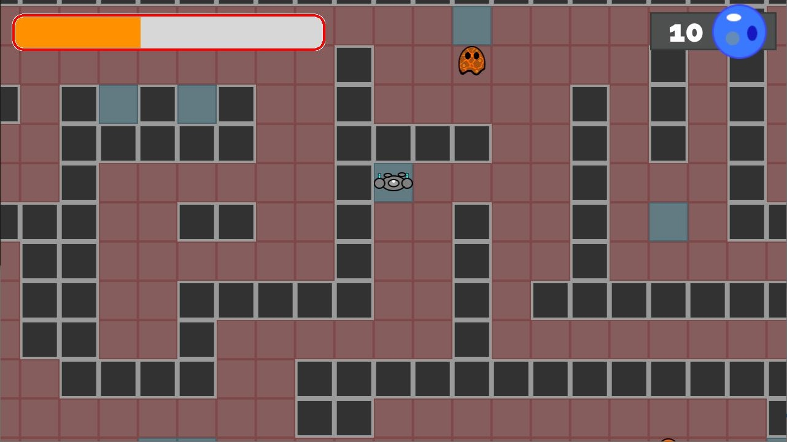

# Melting Point

In Melting Point, you take on the role of one of the last humans in a post-apocalpyic world . Global warming has scorched the Earth and any direct contact with sunlight is deadly. Fortunately, you have a thermal-suit to protect from heat, but it can only do so much. Make it through the levels while trying not to overheat your suit, and watch out for the lava monsters.

You can cool your suit off by standing in cool spots or by shooting your gun, but be careful not to run out of ammo. Your gun also requires heat to function, so make sure your heat bar isn't empty before attacking.

## Download + Install
We currently have versions of the game Windows and Linux OS. Go to the [Releases](https://github.com/DanPerry1808/MeltingPoint/releases) section of the repo and download the zip file for your system. Extract the zip file and then open the executable to play the game.

## Controls
- WASD - move
- Mouse - Aim
- Left click - shoot 1 projectile
- Right click - shoot 3 projectiles in an arc
- Middle click - shoot 8 projectiles in a circle

## Acknowledgements
Thanks to the Godot Engine devs for both making the Godot engine we used for this project, and for the 2D Grid Based Movement Demo we used as a base for this project. Some of the textures and sprites used in the project are from here. Both of these are used under an MIT License. We'd also like to thank [Robert Abrahams on Free Music Archive](https://freemusicarchive.org/music/Robert_Abraham) for the use of his music track [All The Things Lost](https://freemusicarchive.org/music/Robert_Abraham/Top_10_Picks_From_2014/Robert_Abraham_-_01_-_All_the_things_lost).
